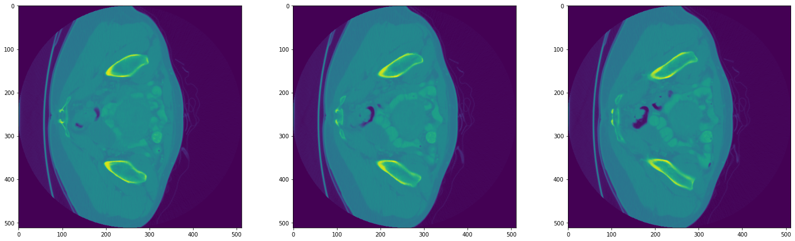
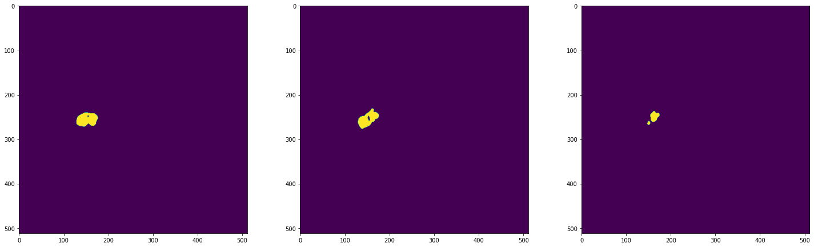
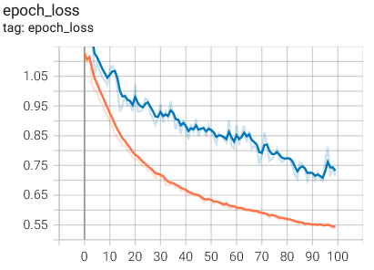
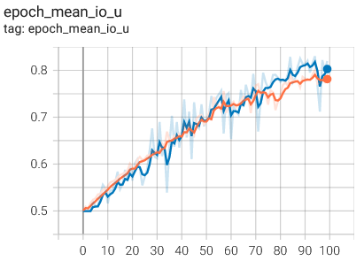
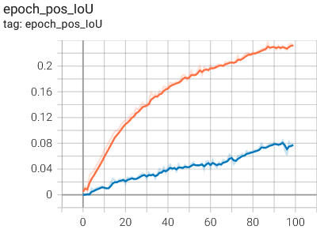
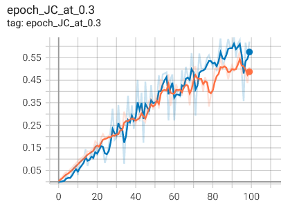
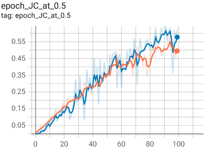
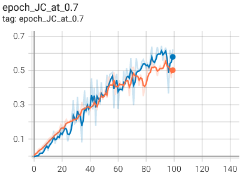
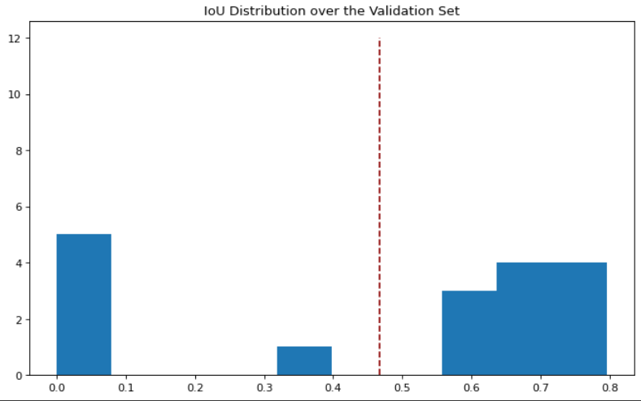

## Colon Cancer Binary Image Segmentation from CT Scans
This repository consists of the first project of Machine Learning for Healthcare course at ETH Zürich.

In this project, we are given 100 colon cancer CT scans of size: 512x512xdepth (varying) and instructed to train image segmentation algorithm, U-Net, that segments colon cancer CT scan images into background or primary.

To formulate a robust deep learning model, our group experimented with the U-Net deep learning architecture and its hyperparameters before deciding on the final model. Overall, we experimented
with different loss functions, learning rates, dropout types and ratios, padding types and number of epochs to determine the best performing model. Finally, we evaluated our model with Intersection over Union (IoU) performance metric and reported mean IoU.

<p align="center" width="100%">

</p>

<p align="center" width="100%">

</p>


### Respiratory Structure
- `data`: A directory containing CT scans.
- `logs`: A directory including the log files for performance monitoring and evaluation on tensorboard.
- `models`: A directory containing the best model states saved during optimization.
- `plots`: The plots.
- `src`: A directory containing utility Python snippet.
- `eval.py`: A Python snippet to evaluate trained algorithm.
- `loss.py`:A Python snippet for defining the loss function and performance metric for evaluation.
- `model.py`: The U-Net network.
- `train_model.py`:A Python snippet for reading the data and conducting DL training and optimization.

### Script

1. Install `virtualenv`:
   ```
   pip install virtualenv
   ```
2. Create virtual environment `myenv`:
    ```
    virtualenv myenv
    ```
3. Activate the environment:
    ```
    myenv\Scripts\activate
    ```
4. Install the required packages:
    ```
    pip install -r requirements.txt
    ```  
5. Run the model training code:
    ```
    python train_model.py
    ```  

### Results

Tensorboard outcomes of optimized the U-Net architecture w.r.t number of epochs are indicated below. Orange color indicates performance on training set while blue color refers to that of on validation set.

<p align="center" width="100%">
    
    
    
</p>

The resulting Jaccard Indices on different threshold values w.r.t number of epochs are indicated below.

<p align="center" width="100%">
    
    
    
</p>

#### Mean IoU Performance
Since each colon CT scan has varying number of slices, we computed mean Intersection over Union across all slices. IoU distribution over the validation set is indicated as below.

Please note that red-dotted line indicates mean IoU value that is 0.467.



### Project Report
The project report consists of brief explanation of the problem, methodologies we used and results that we obtained after model optimization. Please note that final snippet and findings may different from those included in the report.

### Acknowledgments
This project is a collaborative work among Mesut Ceylan, Sven Gregorio and Moritz Vandenhirtz.

### License
This work is licensed under MIT License, however it is subject to repository-owner approval and permission for public and private usage.
